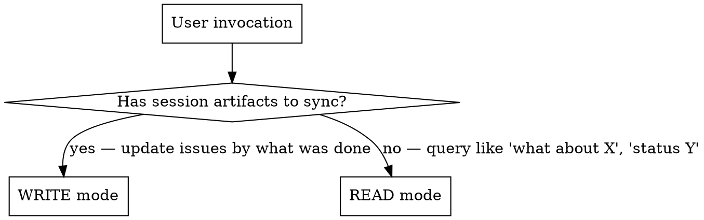
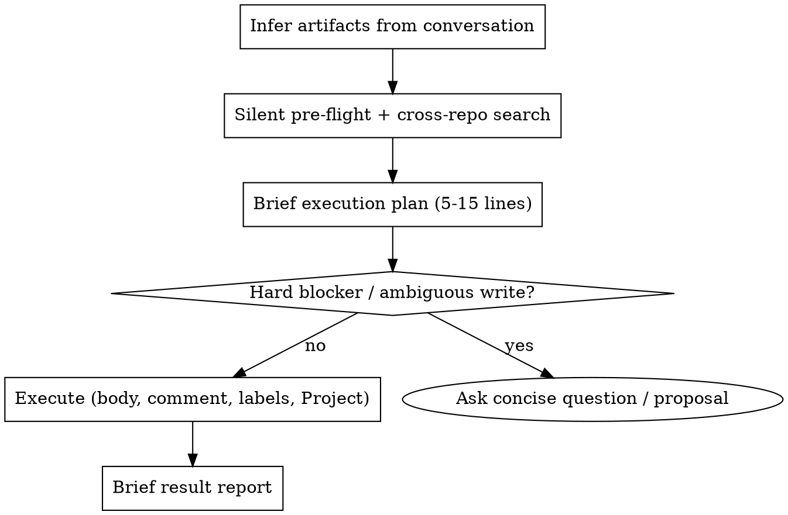

# Manager — bidirectional GitHub issues bridge

Part of the Personal Corp framework — running a one-person business through AI agents.

Bridges session work and GitHub issues in both directions. GitHub issues are the source of truth for tasks; a GitHub Project board is the source of truth for what's active. Manager has two modes:

1. **Write mode (sync)** — at end of session: read what was done, find existing issues, update with progress + a work-record comment, keep parent / W-label / Project invariants, create new only if nothing matches.
2. **Read mode (query)** — anytime: «what about track X?», «status of Y?» → search across your repos, return condensed state of matching issues with parent epic, labels, Project placement, and last activity.

**Manager is the canonical issue workflow.** Do not fall back to a generic issue helper for these operations — manager owns the read-modify-write contract, the invariants, and the Project sync.

## Setup

Before first use, define this in your project's `CLAUDE.md`:

```markdown
## Manager Config

### GitHub owner
Your GitHub username or org for issue search:
- owner: your-github-handle

### Repos to scan (cross-repo issue search scope)
List repos manager should search:
- ~/Projects/main
- ~/Projects/ops
- ~/Projects/marketing

### Tasks index file (optional)
Path to your curated "what's hot this week" file. Manager reads it FIRST before any `gh search` to scope queries:
- tasks_index: ~/docs/tasks.md
(если файла нет — manager работает без индекса, поиск идёт по всем repos)

### Domain → repo routing
| Domain | Repo |
|--------|------|
| commercial / B2B deals | crm |
| product launches | main |
| ops / infrastructure | ops |
| content | marketing |

### GitHub Projects integration
Manager treats Project placement as an invariant (see Iron invariants). Declare your boards:
- weekly_project: <number>          # cross-repo "everything active this week" board
- weekly_project_owner: your-github-handle
- status_field: Status              # the single-select field that holds the lane
- status_in_progress: In progress   # option name (or id) for the active lane
- domain_projects (optional):       # per-domain boards, if you keep them
    | Domain | Project number |
    | commercial | <number> |
    | product | <number> |

Cache resolved field/option IDs here once discovered (`gh project field-list <N> --owner OWNER --format json`) so manager doesn't re-fetch them every run.

### W-label convention (optional)
- enabled: true
- format: W{NN} (ISO week)
(если false — manager создаёт issues без weekly labels)

### Standing write authorization
- mode: ask-each-time | execute-after-plan
(default: ask. execute-after-plan = manager executes writes after showing the brief plan, without separate confirmation)

### CRM integration (optional)
- crm_path: ~/Projects/crm
- crm_pointer_format: [[<slug>]]
(если не используется — секция игнорируется; см. CRM integration ниже)
```

No separate init skill needed — this section is the setup. Title-type metadata is NOT configured here: it lives in labels, the parent tree, and Projects (see Issue title convention).

## Iron invariants

Every issue manager touches MUST satisfy the base three; an active / current-week issue must additionally satisfy the Project and work-record invariants:

1. **W-label** (current or future week, or the date of a specific dated event) — if W-label convention enabled in config. If the label doesn't exist in the repo — create it.
2. **Parent epic** — exactly one parent via GitHub Sub-issues API. Any issue that isn't itself an epic must have a parent. See "Parent epic rules" below.
3. **Track differentiation via title + epic membership** — no track-labels (`<track-slug>`, `<client>-deal`). Track is recognized by title text and epic membership.
4. **Project placement** — an active / current-week issue must be present on its domain Project board (if you keep one) AND on the global weekly Project. A W-label without Project placement = `Project drift`.
5. **Project-visible parent** — for an active / current-week child, one `parent_issue_url` is not enough. The visible root epic must itself be in the relevant Project view with a non-empty status lane.
6. **Work-record comment** — in write mode, only when REAL work happened on the issue this session: a mandatory timeline comment summarizing what was done + commit links. Changing status / label / Project placement does NOT replace it. Pure mechanical re-label / Project-fix with no content work = no comment.

Without these — the issue isn't tracked correctly. If no parent epic exists in any repo — manager raises this in proposal and offers to create or pick an existing one, **before** sync. Never leaves orphan issues.

## Mode resolution



**Signal for write mode:** user said «sync session», «зафиксируй», «обнови issues», OR invoked `/manager` without args at end of session, OR explicitly listed artifacts/changes.

**Signal for read mode:** user asked a question about state — «what about», «status», «есть ли», «какие issues по».

**Bare `/manager` invocation:** infer artifacts from current conversation context — what tracks were touched, what files were modified/created, what decisions were made. Do NOT ask user to re-list everything. Form brief execution plan (5-15 lines), then execute under the configured authorization mode.

**Do NOT use manager for:** creating ideas without artifacts (that's brainstorming); closing an issue without explicit user instruction; batch CRM updates (that's a CRM skill, not manager).

## Output language

Output language matches the user's input language and project conventions. Technical tokens remain as-is and are not translated: issue names (`<repo>#<N>`), labels (`W18`, `retro:W17`, `backlog`), commands (`gh issue comment`), file paths, original English titles of issues in quotes.

### Issue-title language

New issue titles (and renamed titles) follow the user's locale — match the language convention of the project. English is allowed only as a proper noun: product name, repo name, brand, API name, public upstream term (`GitHub`, `Telegram`, `LMS`, `PRD`, `E2E`). English action verbs and generic filler phrases in titles are forbidden:

- ❌ `delivery track`, `launch/funnel`, `follow-up`, `workshop prep`, `handoff`, `rollout package`, `topic TBD`, `date TBD` (as English filler when the project language is not English)

All narrative elements in issue titles, body headers, and proposal text follow the project's locale. Technical tokens (`repo#N`, label names, CLI commands, file paths, quoted original titles of existing issues) stay as-is.

## Sources of truth (read every run)

1. **`$TASKS_INDEX_PATH`** (if configured) — current week index. Source for: what's hot this week, what tracks are active, repo pointers for each track. Read FIRST to frame the session.
2. **GitHub issues across `$YOUR_OWNER/*`** — authoritative for individual tasks. Search via `gh search issues --owner $YOUR_OWNER` or batched GraphQL (see below).
3. **GitHub Project board(s)** — authoritative for what's active this week and in which lane.
4. **CRM artifacts** (if CRM integration enabled in config) — meeting cards, opportunity cards, person cards. NOT a substitute for a GH issue, but the linkage anchor: every comm-related issue body must include a CRM pointer.

## When to use vs when NOT

**Use (write mode):**
- User says "sync session" / "/manager" / "обнови issues по тому что сделал"
- End of working session with concrete artifacts (CRM updates, meeting cards, code commits, docs)

**Use (read mode):**
- Start or middle of session — user asks «what about <track>», «status», «is there an issue for»
- Need cross-repo state of a track without manually grepping
- Before deciding next step — check what's already open

**Do NOT use:**
- For creating new ideas without artifacts — use brainstorming
- For closing issues without explicit user instruction (see Common mistakes)

## Pre-flight (both modes) — HARD PRECONDITION

Pre-flight MUST run before any `gh search`, `gh issue`, or other GH command. No exceptions.

Keep pre-flight silent and minimal. Do not dump tasks index content, full git status, or label catalogues into chat. Read what you need internally, surface only what changes the proposal. **Output budget for pre-flight: 0 lines.**

1. **Read `$TASKS_INDEX_PATH` FIRST** (if configured). This is the curated index of current-week priorities + active tracks + repo pointers. Without it, search is shotgun (random keywords) instead of targeted.
2. **Snapshot the weekly Project once per run** with an explicit high limit (the default page truncates large boards):
   ```bash
   gh project item-list <WEEKLY_PROJECT> --owner $YOUR_OWNER --format json --limit 1000 > /tmp/manager-proj.json
   ```
3. **Task drift guard.** If the current day or week plan contains an active task row with no `repo#N` GitHub issue reference → surface as `Task drift: <row> — no GitHub issue`. In read mode: report only. In write mode: find an existing issue or create one (then it carries the iron invariants). Manager does not rewrite the tasks index itself — index curation is the `weekly-planning` skill's job.
4. Check git status of relevant repos (silently). If specific artifacts referenced in session are uncommitted, mention only those by name in proposal.
5. Compute current ISO week if tasks index "Updated" line is stale (>7 days) or absent.

**Run independent `gh` reads in parallel** — multiple Bash calls in a single message. Run sequentially only when the output of one call is required as input for the next.

### Red flag: skipping tasks index

If you're about to run `gh search issues` without first reading `$TASKS_INDEX_PATH` (when configured) — STOP. You're about to do shotgun search instead of using the Project/track index that already exists.

## Write mode algorithm



In write mode, for each touched issue:

1. Update the **body** (default channel — not a comment): refresh `Status` / `Next` + a dated entry in `## Updates`.
2. Add the **work-record comment** (Iron invariant 6) — only if real work happened: what was done this session + `refs`/SHA.
3. Ensure **W-label + parent (Sub-issues API) + Project placement**, and set the Project status lane to `In progress` (see Project status sync).
4. Record **commit↔issue linkage** (see below).

**Authorization mode** (from your CLAUDE.md config):

- `ask-each-time` (default): after the plan, ask "execute?" before any GitHub write.
- `execute-after-plan`: after the silent pre-flight and brief execution plan, execute scoped GitHub writes without asking a separate confirmation. Still run pre-flight, search existing issues, preserve invariants, and report exactly what changed.

Either mode: ask before writing when the write is genuinely ambiguous or risky — no suitable parent epic, uncertain repo/track ownership, public-repo privacy risk, destructive/bulk changes, closing an issue whose scope is not clearly completed, or conflicting evidence.

### Commit ↔ issue linkage

1. Every commit in a session should carry a trailer: `refs $YOUR_OWNER/<repo>#N` (or `closes $YOUR_OWNER/<repo>#N` if the commit fully closes the scope). GitHub shows a backlink in the issue timeline — works cross-repo.
2. The dated entry in `## Updates` lists short SHAs of commits from each touched repo this session: `(code: <repo-A>@9a8ff92, <repo-B>@6fb5b26)`. An issue with no SHA when commits exist = incomplete sync.
3. Collect SHAs via `git log --oneline -10` per touched repo before writing the Updates entry.
4. **Artifact must be committed and pushed BEFORE being linked.** The user reads everything via web GitHub — an uncommitted local file does not exist for them. Links in body/report must be clickable GitHub URLs, not `~/...` local paths.

### Planning artifacts (PRD / plans / diagrams)

When a session produces a PRD, plan, or diagram: the full content belongs in the **issue body** — context, decision table, mermaid diagrams (GitHub renders them inline), schema, MVP slices, out-of-scope, open questions — not a link to a file. A local md file can exist as a working copy; if they diverge, the issue body is the source of truth. Any file link from the body is a clickable GitHub URL pointing to an already-committed-and-pushed version, never a local path.

## Read mode algorithm

1. Resolve query subject — track name, person, repo, issue number, time window.
2. Run cross-repo search (multi-key) — single `gh search issues` for simple tracks, batched GraphQL for 3+ keys (see below).
3. **Filter false-positives** — drop matches where keyword overlap is incidental (e.g. issue tagged `W18` but unrelated to the queried track). See "False-positive surface" below.
4. For true matches, pull live state in one batched GraphQL call: title, state, labels, parent (Sub-issues API), `projectItems` with status lane, last activity. Prose is not evidence — use live reads.
5. **Resolve track epic** — find the parent epic. Pull `sub_issues_summary` — note `total`, `completed`, `percent_completed` + epic's own `state`.
6. Cross-reference tasks index — does the track appear in the current-week priority list? If yes, mark as "🔥 hot W{NN}". Verify the index row for drift: referenced issue CLOSED, scope mismatch, or implied open work that no longer exists.
7. Output: condensed table (with a Project column) + open questions + "what's NOT covered yet" gaps + drift surface. Read mode never writes to GitHub.

### Live Project state reads — batched GraphQL

When surfacing or correcting Project placement, batch up to ~20 issues in one GraphQL call via aliases:

```bash
gh api graphql -f query='
query {
  i1: repository(owner:"$YOUR_OWNER", name:"<repo1>") { issue(number:<N1>) { ...IssueState } }
  i2: repository(owner:"$YOUR_OWNER", name:"<repo2>") { issue(number:<N2>) { ...IssueState } }
}
fragment IssueState on Issue {
  number title state url
  labels(first:20){nodes{name}}
  parent { number title repository { nameWithOwner } }
  projectItems(first:10){nodes{ id project { number title } fieldValueByName(name:"Status"){ ... on ProjectV2ItemFieldSingleSelectValue { name } } }}
}' | jq -r '(.data // {}) | to_entries[] | .value.issue | select(. != null)
  | "\(.number) \(.title) [\([(.labels.nodes // [])[].name]|join(","))] parent=\(.parent.repository.nameWithOwner // "—")#\(.parent.number // "") projects=\([(.projectItems.nodes // [])[] | "\(.project.title):\(.fieldValueByName.name // "empty")"]|join(" | "))"'
```

Notes: pipe into a separate `jq`, **not** the `--jq` flag (see the CRITICAL note in the batched-search section — when a GraphQL response carries `errors`, `gh` ignores `--jq` and dumps the raw body). `parent` is the Sub-issues API parent; `projectItems[].fieldValueByName.name` is the status lane. Result is at `.data.<alias>.issue` — don't forget the `.issue` level in jq. Single-issue fallback: `gh issue view N -R $YOUR_OWNER/<repo> --json projectItems` — `.projectItems[].status` is an object; read `.status.name`, not `.status`. List epic children: `gh api repos/$YOUR_OWNER/<repo>/issues/<EPIC_N>/sub_issues --jq '.[] | {number, title, repository_url}'`.

### Parent-proof ambiguity

When verifying parent visibility: check both the child's `parent_issue_url` AND the parent's `/sub_issues` endpoint. If child-side parent reads as `null` but parent `/sub_issues` lists the child, report `parent proof: parent sub_issues ✓; child API ambiguous` — not `parent missing`. The two API surfaces can disagree transiently.

### Related context, not hierarchy

Build a `Related` context list only for true matches with a distinct scope: a separate task, contextual reference, dependency, cross-repo artifact, or historical task. Filter out parent/child links already expressed through the Sub-issues API — those are already visible in the hierarchy column. Do not duplicate API-expressed structure as `Related` prose.

## Search for existing issues

Full rules: [references/search-strategies.md](references/search-strategies.md)

## Parent epic rules

Full rules: [references/epic-and-relations.md](references/epic-and-relations.md)

## Project status sync (write mode)

In write mode, when the user actively worked on an issue in the current session, manager **must** set the Project status lane to `In progress` on all primary/child issues touched in:

- The global weekly Project
- The domain-specific Project board for the track, if the issue already lives there

**Rules:**
1. Only update issues that manager updated or created in this sync, plus their visible parent if the parent is also in the current day plan.
2. Do not set `In progress` on historical/backlog issues with no work in this session.
3. Do not downgrade `Done` or `In review` without explicit user signal.
4. If the item is not yet in the Project — run `gh project item-add` first, then `gh project item-edit` to set status.
5. If the parent/session issue of a child is in the day plan and the child is active today — also move the parent to `In progress`.

```bash
# Step 1 — get item id (from item-add output or item-list snapshot)
# Step 2 — get field and option ids (cache these in your config)
gh project field-list <PROJECT_NUMBER> --owner $YOUR_OWNER --format json
# Step 3 — set status lane
gh project item-edit \
  --id <PVTI_id> \
  --project-id <project-id> \
  --field-id <status-field-id> \
  --single-select-option-id <in-progress-option-id>
```

For each domain board, read its field list first — lane names may differ (`In progress` vs `In Progress` vs `Active`).

**Project drift rules:**
- Issue in Project with empty Status field → surface as `Project drift: status lane empty`.
- If a GraphQL/rate-limit error blocks the status edit → report `Project drift: placement ok, status lane pending` and do not claim full repair.

## W-label rules

Full rules: [references/week-labels.md](references/week-labels.md)

## Issue title convention

Full rules: [references/title-and-metadata.md](references/title-and-metadata.md)
